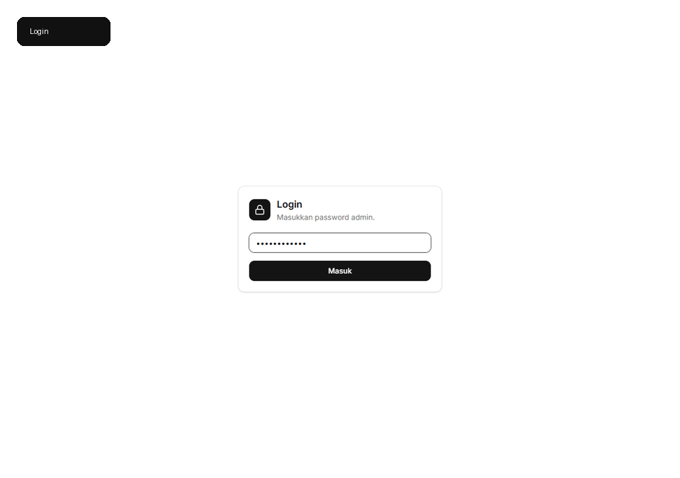
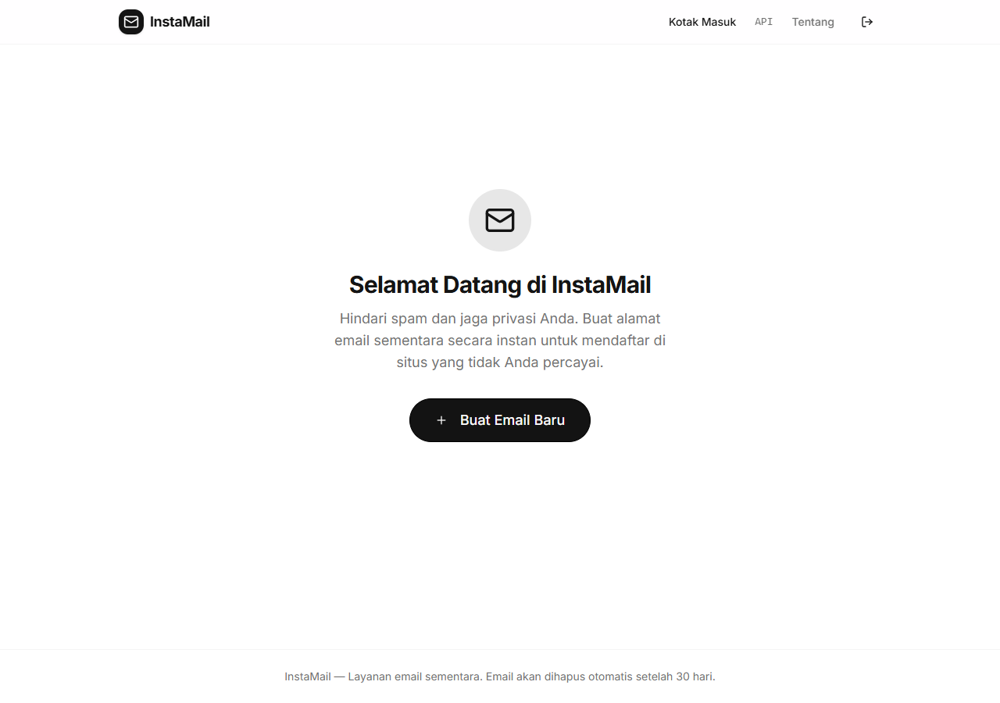
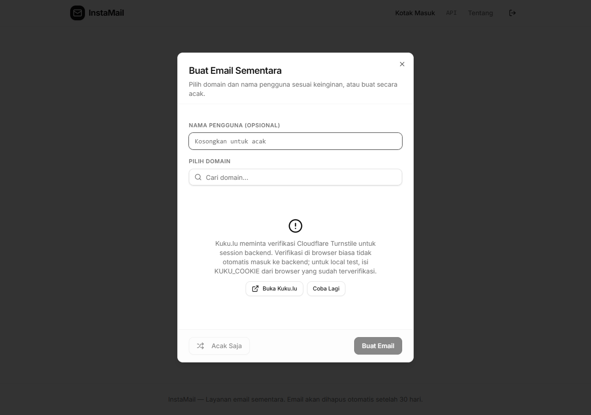
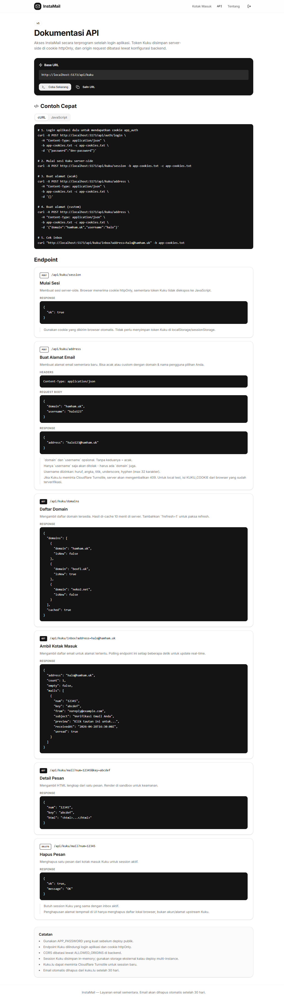

# InstaMail

Temporary inbox UI with a small server-side bridge for Kuku.lu.

This repo is built for local testing first: run the API, run the web app, log in, then use the UI to manage disposable inboxes. The Kuku session stays on the backend instead of being stored in browser JavaScript.



## Preview

| Inbox | Create dialog |
| --- | --- |
|  |  |



## What It Does

- Password gate for the local app.
- Server-side Kuku session with httpOnly cookies.
- Disposable inbox list with saved addresses in local browser storage.
- Mail detail view rendered in a sandboxed iframe.
- Delete message action for Kuku inbox messages.
- Remove saved tempmail addresses from the local list.
- API docs page with copyable cURL and JavaScript examples.
- Basic production hardening: origin guard, rate limit, no-store responses, no `x-powered-by`, small request body limits.

## Local Run

```powershell
corepack enable
corepack pnpm install
Copy-Item .env.api.example .env.api.local
Copy-Item .env.web.example .env.web.local
corepack pnpm run dev:api
corepack pnpm run dev:web
```

Open:

```text
http://localhost:5173
```

Default local password:

```text
dev-password
```

Change `APP_PASSWORD` in `.env.api.local` before sharing the app with anyone.

## Environment

API:

```env
NODE_ENV=production
PORT=8080
APP_PASSWORD=change-this-admin-password
AUTH_SECRET=change-this-to-a-long-random-secret-at-least-32-chars
ALLOWED_ORIGINS=https://your-domain.com
RATE_LIMIT_PER_MINUTE=120
KUKU_COOKIE=
```

Web:

```env
PORT=5173
BASE_PATH=/
```

`KUKU_COOKIE` is optional and should stay local. Kuku.lu may ask for Cloudflare Turnstile on new backend sessions. If that happens during local testing, verify Kuku.lu in your browser, copy the verified `m.kuku.lu` Cookie header, and paste it into `.env.api.local`.

Never commit real cookies or `.env.*.local` files.

## Useful Commands

```powershell
corepack pnpm run typecheck
corepack pnpm run build
corepack pnpm run dev:api
corepack pnpm run dev:web
```

## Deployment Notes

- Set `NODE_ENV=production`.
- Use a strong `APP_PASSWORD`.
- Generate a long random `AUTH_SECRET`.
- Set `ALLOWED_ORIGINS` to the exact public web origin.
- Keep `KUKU_COOKIE` out of GitHub and CI logs.
- The current Kuku session store is in memory. Use Redis, Postgres, or another shared store for multi-instance hosting.

## Security Notes

- Login uses a signed httpOnly cookie.
- Kuku session data stays server-side.
- Request bodies are capped at `32kb`.
- API responses use `Cache-Control: no-store`.
- The app strips Kuku session values from frontend storage.
- External email HTML is rendered separately and normalized before display.

## Known Limitation

Kuku.lu can require Cloudflare Turnstile for new backend sessions. This project does not bypass that. For local testing, use a verified `KUKU_COOKIE`; for public deployment, expect this upstream behavior to affect fresh sessions.

